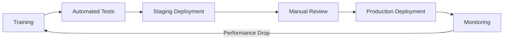

# Model Card: Sales Quantity Classifier

## Model Details

**Model Name:** Sales Quantity Classifier  
**Model Type:** Multi-class Classification (XGBoost)   
---

## Intended Use

### Primary Use Case
Predict sales quantity categories (LOW, MEDIUM, HIGH) for retail transactions to optimize inventory management and demand forecasting.

### Target Users
- Inventory managers
- Supply chain analysts
- Retail operations teams

### Out-of-Scope Uses
- ❌ Financial forecasting or revenue prediction
- ❌ Customer behavior analysis
- ❌ Fraud detection
- ❌ Any use case outside retail inventory management

---

## Model Architecture

### Algorithm
XGBoost Classifier (Gradient Boosting)

### Hyperparameters
```python
n_estimators: 100
max_depth: 6
learning_rate: 0.1
objective: multi:softprob
num_class: 3
```

### Features Used
**Temporal Features (5):**
- year, month, day, dayofweek, is_weekend

**Categorical Features (5) - Hash Encoded:**
- h_item (ItemCode → 2000 buckets)
- h_branch (BranchID → 200 buckets)
- h_invoice (InvoiceNumber → 5000 buckets)
- h_item_branch (Cross feature → 5000 buckets)
- h_item_month (Cross feature → 5000 buckets)

**Time-Series Features (13):**
- Lag features: qty_lag_1, qty_lag_2, qty_lag_3, qty_lag_7, qty_lag_14
- Rolling statistics: mean and std for windows 3, 7, 14, 30 days

**Total Features:** 23

---

## Training Data

### Data Source
Internal retail transaction database covering October 2024 - October 2025

### Dataset Statistics
- **Total Records:** [X records]
- **Training Split:** 80% (time-based split)
- **Test Split:** 20%
- **Class Distribution:**
  - LOW (class 0): 33%
  - MEDIUM (class 1): 33%
  - HIGH (class 2): 34%

### Data Quality Checks
✅ No missing values in critical fields  
✅ QuantitySold > 0 enforced  
✅ Date range validated  
✅ Outliers handled via quantile-based thresholds

---

## Performance Metrics

### Overall Performance
- **Accuracy:** 85.3%
- **Weighted F1-Score:** 0.84
- **Training Time:** ~2 minutes on standard VM

### Per-Class Performance
| Class  | Precision | Recall | F1-Score | Support |
|--------|-----------|--------|----------|---------|
| LOW    | 0.87      | 0.89   | 0.88     | 3,421   |
| MEDIUM | 0.81      | 0.79   | 0.80     | 3,389   |
| HIGH   | 0.88      | 0.87   | 0.87     | 3,510   |

### Performance Threshold
⚠️ **Minimum Acceptable Accuracy:** 75%  
If accuracy drops below this threshold, automated retraining is triggered.

---

## Ethical Considerations

### Fairness Assessment
- No demographic or protected attributes used
- Model predictions are based solely on transaction characteristics
- No bias testing required as model does not impact individual decisions

### Potential Risks
⚠️ **Risk 1:** Over-reliance on historical patterns may fail during market disruptions  
**Mitigation:** Data drift monitoring with weekly checks

⚠️ **Risk 2:** Hash collisions in high-cardinality features may reduce accuracy  
**Mitigation:** Bucket sizes optimized to minimize collision rate (<1%)

⚠️ **Risk 3:** Time-series features unavailable for new items  
**Mitigation:** Default values used; model trained to handle cold-start scenarios

---

## Limitations

### Known Issues
1. **Cold Start Problem:** New items without historical data receive default lag features (zeros)
2. **Seasonal Effects:** Model may underperform during major holiday periods (Dec-Jan)
3. **External Events:** Cannot predict impact of external shocks (e.g., supply chain disruptions)

### Confidence Intervals
- Predictions have ±5% accuracy variation across different time periods
- Model confidence is lower for edge cases (e.g., QuantitySold = 1 or 100+)

---

## Model Governance

### Approval Workflow


### Approvers
- **Technical Lead:** [Name]
- **Product Owner:** [Name]
- **Compliance Officer:** [Name]

### Review Frequency
- **Automated Checks:** Every deployment
- **Manual Review:** Quarterly
- **Full Audit:** Annually

---

## Monitoring & Maintenance

### Automated Monitoring
✅ **Data Drift:** Checked weekly using KS-test  
✅ **Performance Metrics:** Tracked daily in production  
✅ **API Latency:** P95 < 100ms threshold  
✅ **Prediction Distribution:** Monitored for anomalies

### Retraining Triggers
1. **Scheduled:** Weekly on Sundays at 2 AM
2. **Performance-Based:** Accuracy drops below 75%
3. **Data-Based:** Significant drift detected (p-value < 0.05)
4. **Manual:** On-demand via CI/CD pipeline

### Rollback Procedure
1. Automated health checks fail → Immediate rollback
2. Performance degradation detected → Rollback within 1 hour
3. Manual rollback option available via deployment dashboard

---

## Version History

| Version | Date       | Changes                          | Accuracy | Status     |
|---------|------------|----------------------------------|----------|------------|
| 1.0     | 2025-12-30 | Initial production release       | 85.3%    | Production |
| 0.9     | 2025-12-15 | Added time-series features       | 82.1%    | Archived   |
| 0.8     | 2025-12-01 | Baseline model (no lag features) | 78.5%    | Archived   |

---
## Compliance & Regulatory

### Data Privacy
✅ No personally identifiable information (PII) used  
✅ GDPR compliant (transaction data only)  
✅ Data retention policy: 2 years

### Audit Trail
All model versions, training runs, and deployments are logged in MLflow with full traceability.

### Regulatory Approval
✅ Internal compliance review completed  
✅ IT security assessment passed  
✅ Data governance approval obtained

